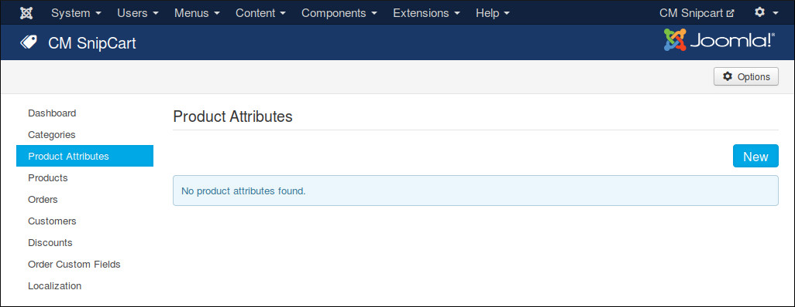
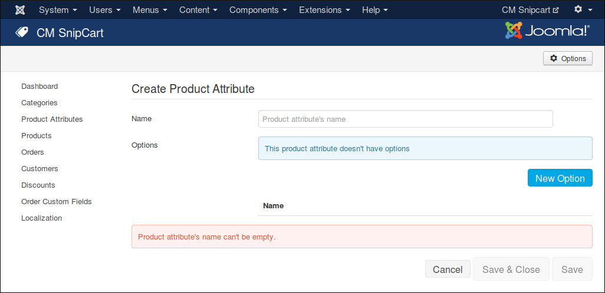
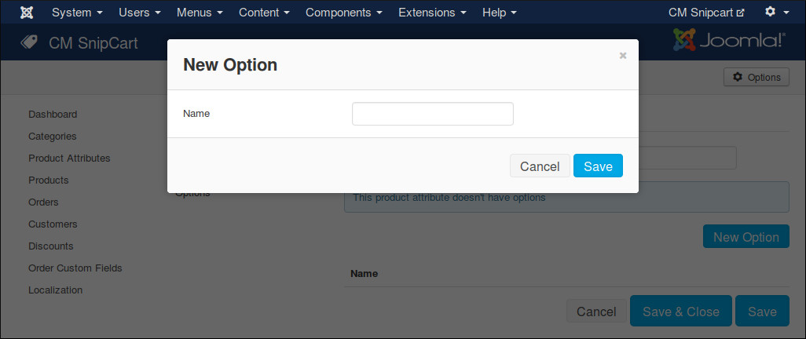
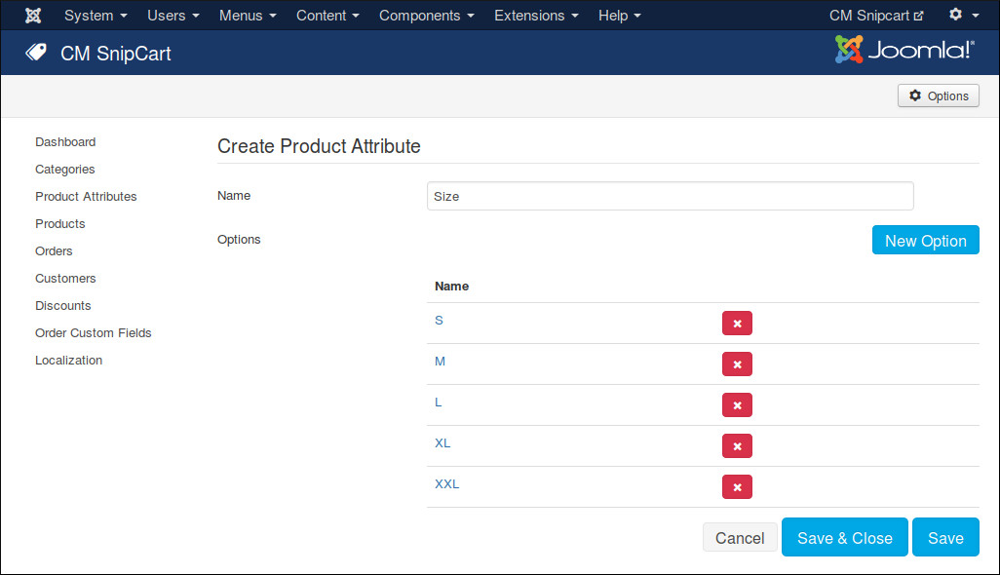
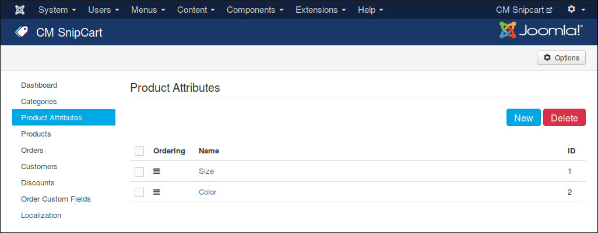

==================
Product Attributes
==================

If your product has many characteristics which require customers to choose before purchase, product attribute helps you create these characteristics.

In your Joomla! back-end, navigate to Components -> CM Snipcart. Click "Product Attributes" in the left menu.

Click "New" button to create a new product attribute.

You give your product attribute a name, click "New Option" to add options for this attributes. You can select these options when you create/edit products, customers select these options before purchase.

To delete an option, you click the red X button on the right side of option's name.

To delete product attributes, you select them and click "Delete" button.

To sort product attributes you drag and drop the icons in "Ordering" column.