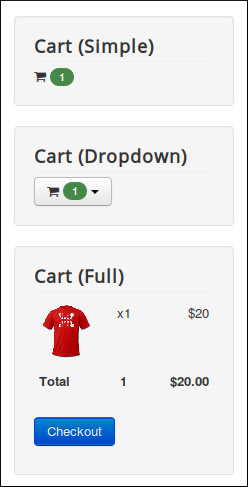

====================
Shopping Cart Module
====================

Shopping cart module helps you show the current items in customer's shopping cart, this is done by using Snipcart's JavaScript API.

Go to Modules section in your Joomla! back-end by navigating to Extensions -> Modules. You can use the module "CM Snipcart - Shopping Cart module" in the list of your modules, it is installed and created automatically when you install CMSnipcart's package. In case you don't see shopping cart module in your module list, you can click "New" button on the toolbar to create one.

.. image:: ../images/module_list.jpg

Just like any other Joomla! modules, in the module setting you can assign the module to a specific position in "Position" option and decide what pages the module is shown in in "Menu Assignment" tab.

.. image:: ../images/module_cart_form.jpg

You can show the shopping cart module in 3 ways:

* **Simple**: Only display shopping cart icon and item quantity.
* **Dropdown**: Display list of items in a button dropdown.
* **Full**: Display list of items vertically and cart's total amount.

You can see the sample results in the screenshot below:

