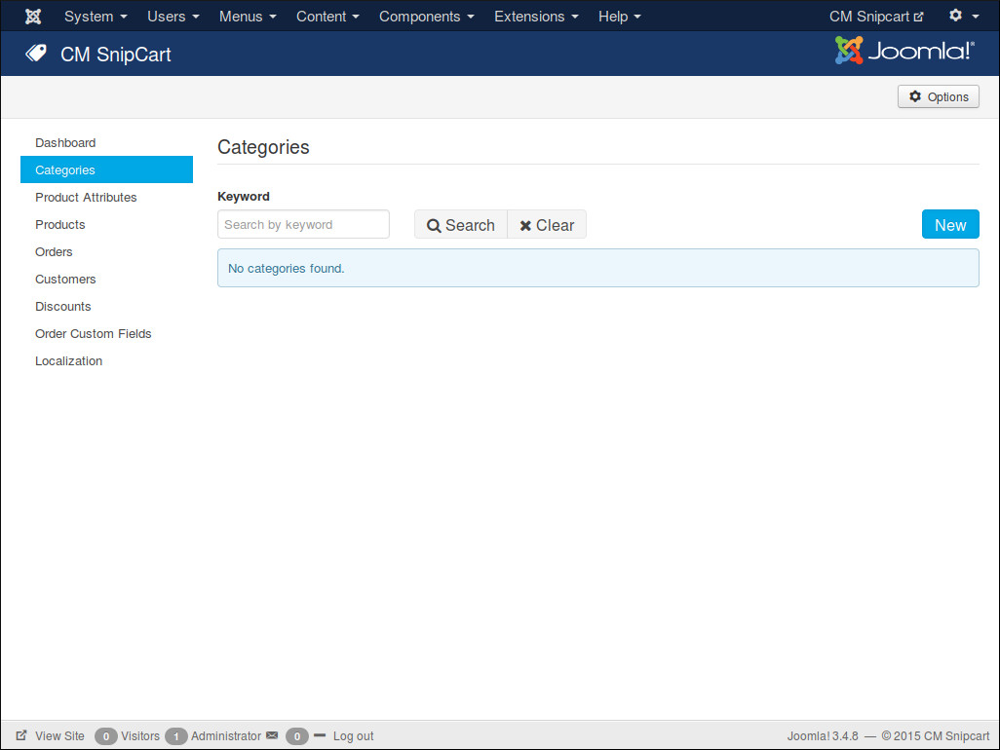
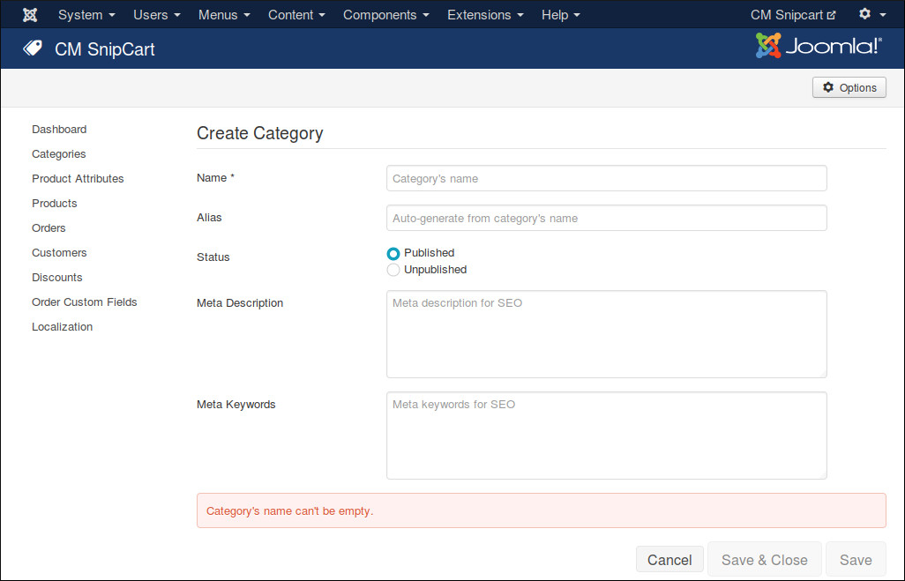
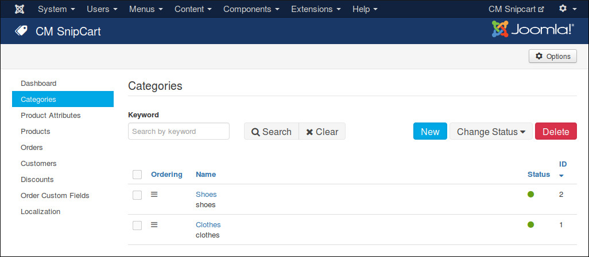
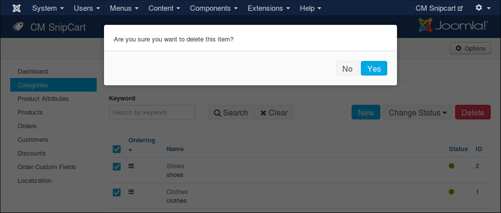
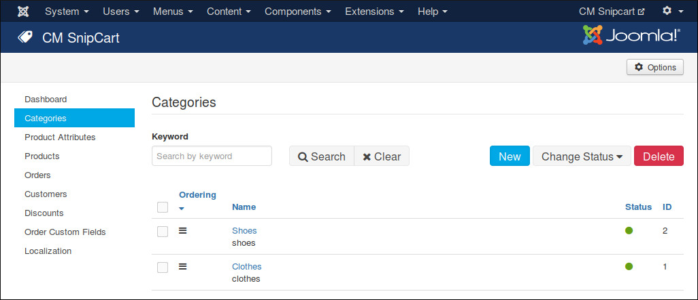

==========
Categories
==========

Create New Category
-------------------

Go to CMSnipcart in your Joomla! back-end by navigating to Components -> CM Snipcart. Click "Categories" in the left menu.

To create a new category, you click "New" button.

We have the following fields in the form:

* **Name**: Category's name.
* **Alias**: Category's alias for friendly URL. This alias is not used yet, you can leave this field empty or keep the auto-generated value.
* **Status**: This info is currently not used. You can keep the default "Published" value.
* **Meta Description**: Meta description for search engine optimization.
* **Meta Keywords**: Meta keywords for search engine optimization. Keywords are separated by comma.

Change Status
-------------

In category list, you can click on category name to edit a specific category and change its status. You can change status directly in category list by clicking the green or red circle in "Status" column. You can do the same to products and order custom fields.

Delete Categories
-----------------

To delete categories, you select them in category list and click "Delete" buton. A confirmation popup appears, you click "Yes" to confirm and delete the selected categories. Similar popups appear when you delete products and order custom fields.

Sort Categories
---------------

By sorting categories, you decide the ordering of the categories. This feature is currently not used yet in front-end, it will be used in future when more features are added to CMSnipcart.

To sort categories, you click "Ordering" column header in category list, then you click drag and drop the icons in "Ordering" column to sort the categories.

You can also sort products, order custom fields and product attributes.