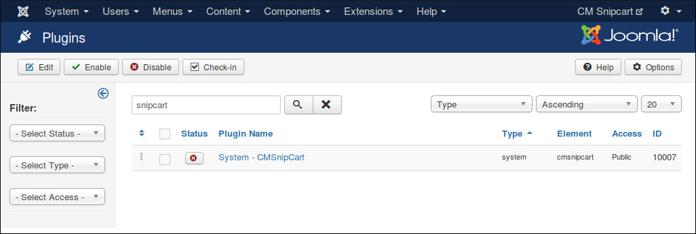
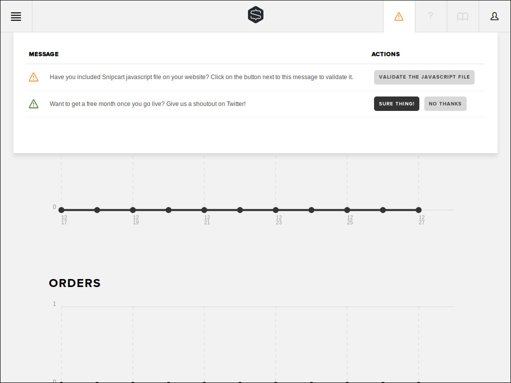
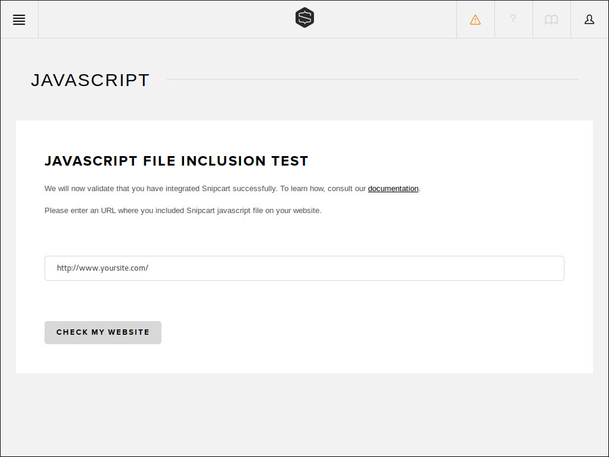
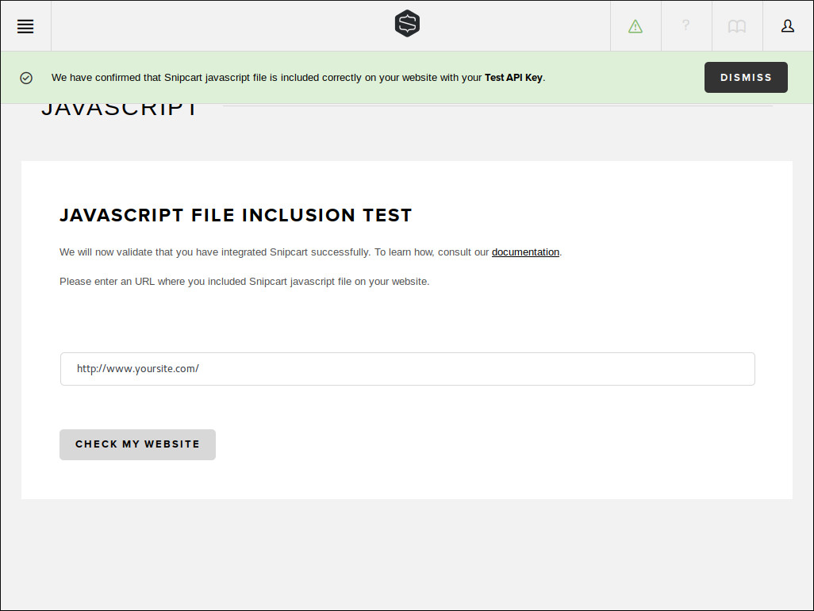
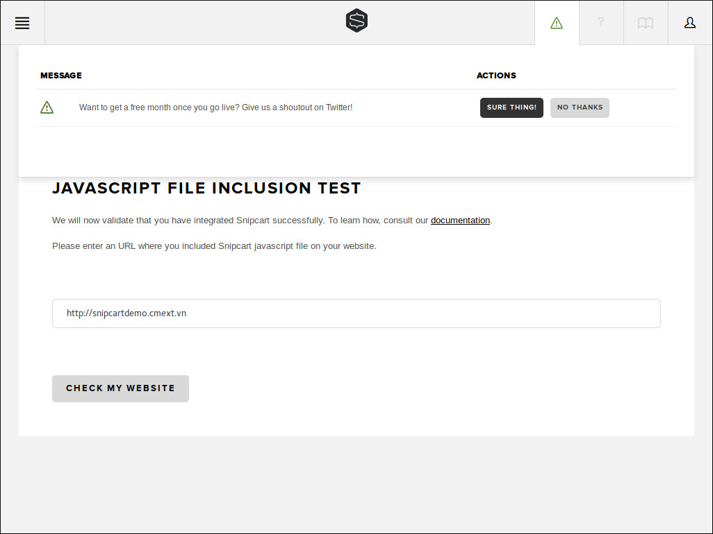

========================
CMSnipcart system plugin
========================

After enter your public API key in CMSnipcart component's configuration, you need to check if Snipcart can connect to your site.

In your back-end, you go to Extensions -> Plugins, search for "System - CMSnipcart" plugin and enable this plugin.

In your Snipcart dashboard, click "VALIDATE THE JAVASCRIPT FILE" button next to "Have you included Snipcart javascript file on your website? Click on the button next to this message to validate it." message in your notification section.

Enter your site's URL in the next step.

If the validation is successful, you see the message "We have confirmed that Snipcart javascript file is included correctly on  your website with your API Key."

The notification "Have you included Snipcart javascript file on your website? Click on the button next to this message to validate it." now disappears.

