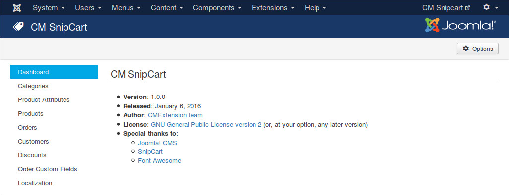

=============
Configuration
=============

In your Joomla!'s back-end, you go to Components -> CM Snipcart to access CMSnipcart component.

.. image:: ../images/cmsnipcart_menu.jpg

The default page is the dashboard.

You click the "Options" button on the toolbar to configure CMSnipcart. You can find 6 configuration tabs: Mode & Credentials, General, Shopping Cart & Checkout, Currency, Notification and Permissions.

Mode & Credentials
==================

In "Mode & Credentials" tab we have the folling options:

* **Mode:** Your Snipcart shop's mode.
* **Live Public API Key:** The public API key for your shop when it is in Live mode.
* **Test Public API Key:** The public API key for your shop when it is in Test mode.
* **Live Secret API Key:** The secrect API key for your shop when it is in Live mode.
* **Test Secret API Key:** The secrect API key for your shop when it is in Test mode.
* **Webhook secret key:** A secret key which is appended to webhook URL to protect it from public access. This webhook is used to receive notifications for your orders from Snipcart. Webhook must be enabled in order to control your product stocks (inventory). Your webhook URL looks like this::

    http://www.yoursite.com/index.php?option=com_cmsnipcart&task=webhook&key=WEBHOOK_SECRECT_KEY

Get API Keys
------------

To get your API keys, log into Snipcart, open the right menu.

Click "API KEYS" menu item.

On the top of the page, you can switch between Live and Test mode. In each mode you have different public API key and secret API Key.

Copy your public API key to public API key field in your CMSnipcart's configuration. At the bottom of the page, create your secrect API key and copy it to secret API key field in CMSnipcart's configuration. Be careful to paste the keys into the correct mode field (if you are in Test mode, paste to the fields of Test mode).

Configure Domain
----------------

In your Snipcart dashboard, open the right menu, click "DOMAINS & URLS" menu item.

Select the protocol your website uses in "PROTOCOL" option (HTTP or HTTPS), enter your domain in "DOMAIN" field. This is the domain of your shopping site.

Configure Webhooks
------------------

In your Snipcart dashboard, open the right menu, click "WEBHOOKS" menu item.

Enter your webhook URL into "WEBHOOKS URL" field. Your webhook URL looks like this::

    http://www.yoursite.com/index.php?option=com_cmsnipcart&task=webhook&key=WEBHOOK_SECRECT_KEY

Replace "http://www.yoursite.com" with the URL of your website and "WEBHOOK_SECRECT_KEY" with the webhook secret key which you configure in CMSnipcart's configuration.

**IMPORTANT**: Webhook must be enabled in order to control your product stocks.

General
=======

.. image:: ../images/cmsnipcart_config_general.jpg

In "General" tab we have the folling options:

* **Load Joomla!'s jQuery:** Load the jQuery version which is shipped with Joomla!. CMSnipcart requires jQuery to work. Set this option to No if jQuery is already loaded by another extension.
* **Bootstrap:** The Bootstrap version available in front-end. Bootstrap is often loaded by your template.
* **Default Max Quantity Allowed To Buy:** You can set the max quantity which customer can buy for a product in every checkout, if that value is 0, this default value is used instead.
* **Front-end's Pagination Limit:** The number of items is displayed in front-end product list. Default is 20 items.
* **Back-end's Pagination Limit:** The number of items is displayed in back-end list. Default is 20 items.
* **Load FontAwesome:** CMSnipcart uses FontAwesome, load FontAwesome from CMSnipcart if FontAwesome is not loaded by other extensions.
* **Load override CSS file:** Load override CSS file to override Snipcart default styles. You need to create components/com_cmsnipcart/assets/css/snipcart.css file and add your override CSS styles.
* **Social Network buttons:** Show social network buttons.
* **Change Product Thumbnail With Selected Child Product's Thumbnail:** Update product's thumbnail image in deal detail page with the image of the selected child product.
* **Zoom Thumbnail On Hover:** Zoom product's thumbnail on mouse hover.
* **Snipcart's Language:** Use another language for Snipcart instead of English.

Shopping Cart & Checkout
========================

In "Shopping Cart & Checkout" tab we have the folling options:

* **Add To Cart Mode:** The way we add product to shopping cart.
* **Show Shopping Cart Popup When Adding An Item:** Automatically show shopping cart popup when adding an item to the cart.
* **Show Continue Shopping Button:** Show Continue Shopping button in shopping cart.
* **Allowed Credit Cards:** Credit cards you want available during checkout.
* **Allowed Shipping Methods:** Enter shipping method's IDs, seperated by a comma. For example: fedex-2-day,fedex-express-saver. You can create shipping methods in Snipcart dashboard. If no shipping methods is set, all shipping methods are allowed.
* **Autocheck "Use this address for shipping":** Check "Use this address for shipping" checkbox automatically.

Currency
========

In "Currency" tab we have the folling options:

* **Currency symbol:** Currency symbol which is used for original price, discounted price and discounted value.
* **Currency symbol's position:** Where currency symbol is displayed, before or after amount.
* **Currency decimals:** The number of decimals in currency.
* **Decimal point:** The character which is used as decimal point.
* **Thousands separator:** The character which is used as thousands separator.

Notification
============

"Notification" tab contains the options for AJAX notifications in back-end, these notifications notify you if a task is done successfully or if there is any errors.

* **Notification position** Where notification is displayed on the page.
* **Notification's timeout (seconds)** The number of seconds a notification is visible after disappears.

Persmissions
============

"Permissions" tab allows you to configue what users in specific user groups can do.

If you are the only one can access Joomla! back-end or if all the users who can access Joomla! back-end have the same rights, you can leave these options with default settings. However if you allow other users to access Joomla! back-end and want to limit their rights in CMSnipcart component, you can adjust these settings to suit your needs.