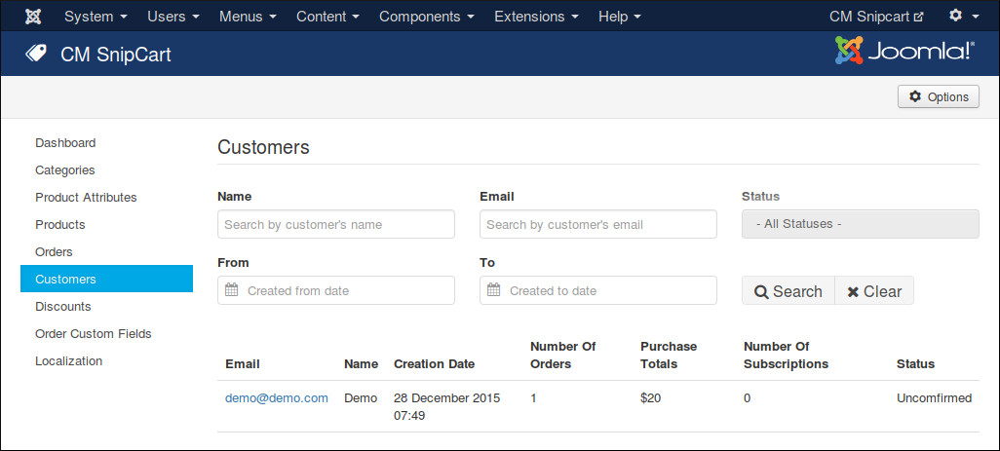
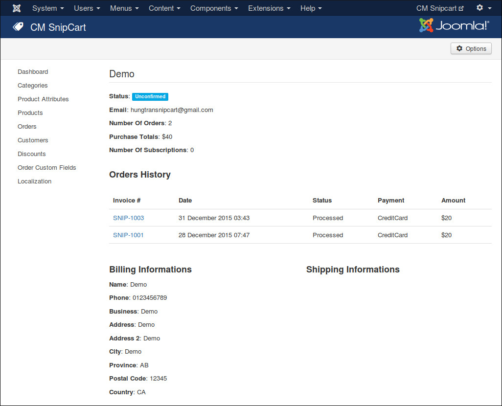

=========
Customers
=========

To view your customers, in you back-end you browse to Components -> CM Snipcart -> Customers.

To view customer's detail, you click on the email address.

In customer detail, you can click on order's invoce to view order detail.