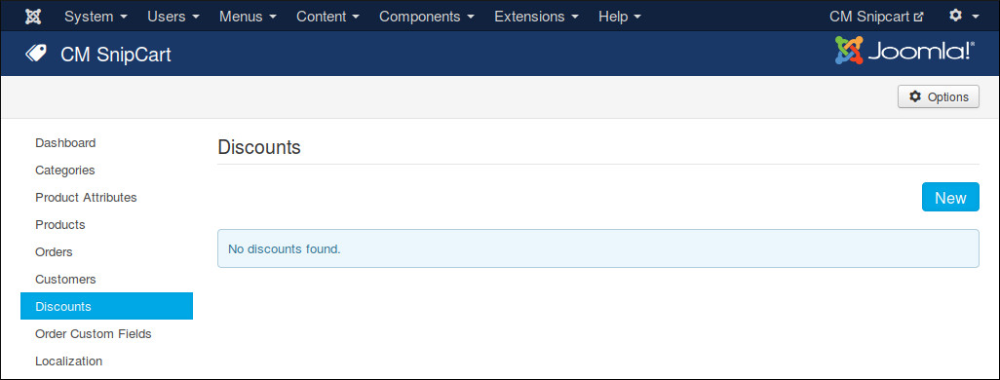
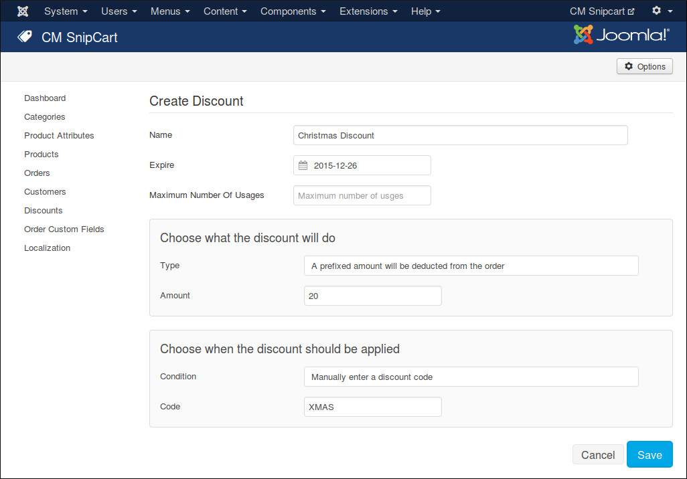

=========
Discounts
=========

You can create discounts in your Snipcart dashboard. However with Snipcart API, CMSnipcart helps you create and manage discounts right in your Joomla! back-end.

In CMSnipcart, you click "Discounts" in the left menu to access discount list.

Click "New" button to create a new discount.

You provide a name for your discount, select an expire date if you need one, set maximum number of usages if you want to limit how many times this discount is used.

In "Choose what the discount will do" section, there are various options depending what discount type you select:

* **A prefixed amount will be deducted from the order**: You need to provide the amount you want to deduct from order total.
* **A percentage rebate on the total of the order**: You need to provide the percentage amount you want to deduct from order total.
* **A discount price provided by an alternate price list**: This discount type is currently not supported in CMSnipcart.
* **A discount on the shipping**: You need to provide your shipping's description, amount and guaranteed days to delivery
* **A prefixed amount will be deducted on specified products**: You need to enter discount amount and product unique IDs which you want to apply discount to.
* **A rate will be deducted on specified products**: You need to enter discount rate and product unique IDs which you want to apply discount to.
* **Offer free products when a customer buys a specified quantity of a product**: You need to enter the required quantity in order to have this discount and the quantity of free items.

In "Choose when the discount should be applied" section, there are various options depending what condition you select:

* **Manually enter a discount code**: You need to enter a discount code.
* **When a specific product is added**: You need to enter the unique ID of the required product.
* **When an order reach a specific amount**: You need to enter the minimum amount.
* **When a product is added a number of times**: You need to enter the quantity (or minimum and maximum quantity if you check "Specify an interval" checkbox), and the unique IDs of the products if you check "Triggered only when the quantity is reached on a product in particular.".
* **When cart only contains some specified products**: You need to enter the unique IDs of the required products.