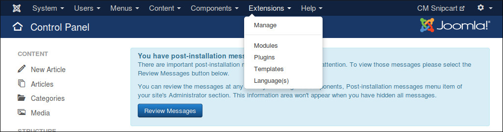
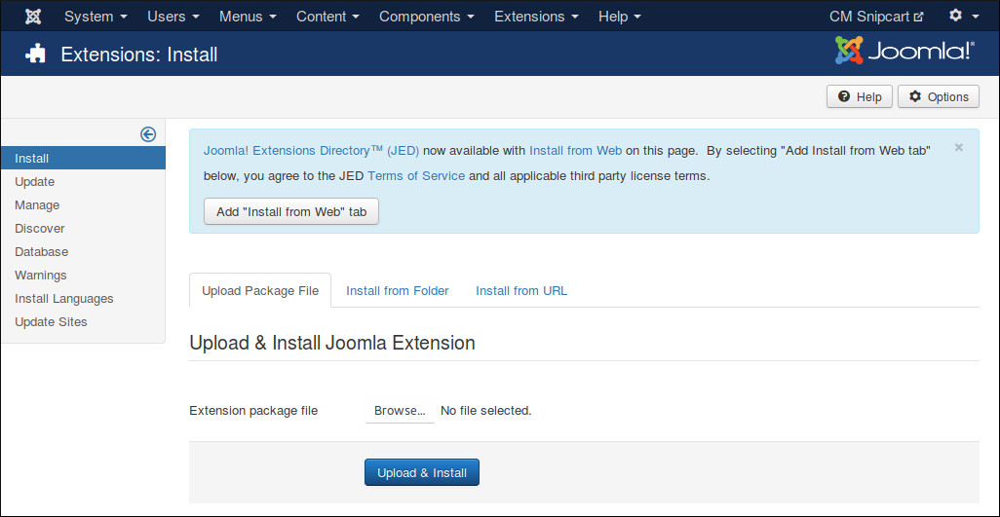
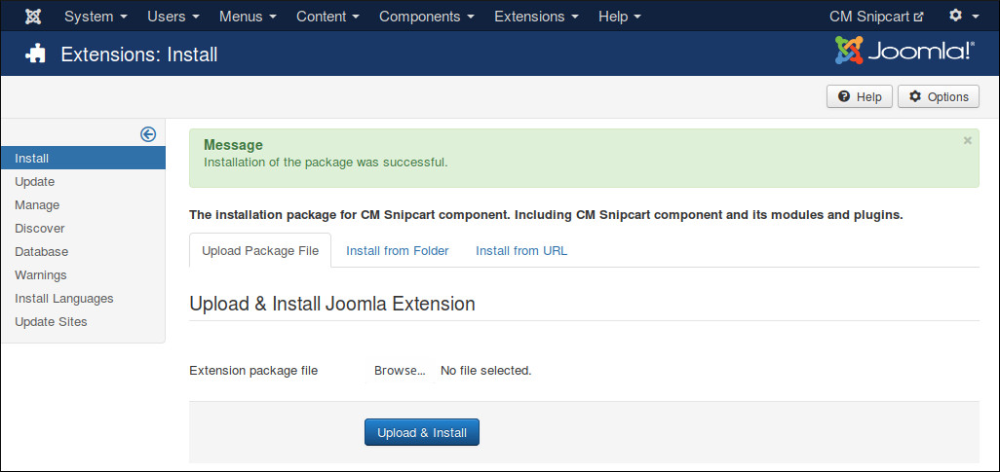

============
Installation
============

Installation
------------

In your Joomla! back-end, you navigate to Extensions -> Manage

In "Upload Package File" tab, you click "Browse" button and select the installation package of CMSnipcart on your computer, click "Upload & Install" button to upload the package to your server and install it.

If the package is installed successfully, you receive the message "Installion of the package package was successful."

You can see CMSnipcart in Components menu item.

.. image:: ../images/cmsnipcart_menu.jpg

Update
------

In order to updating CMSnipcart to a greater version, you just need to install the new package, there is no extra steps required.