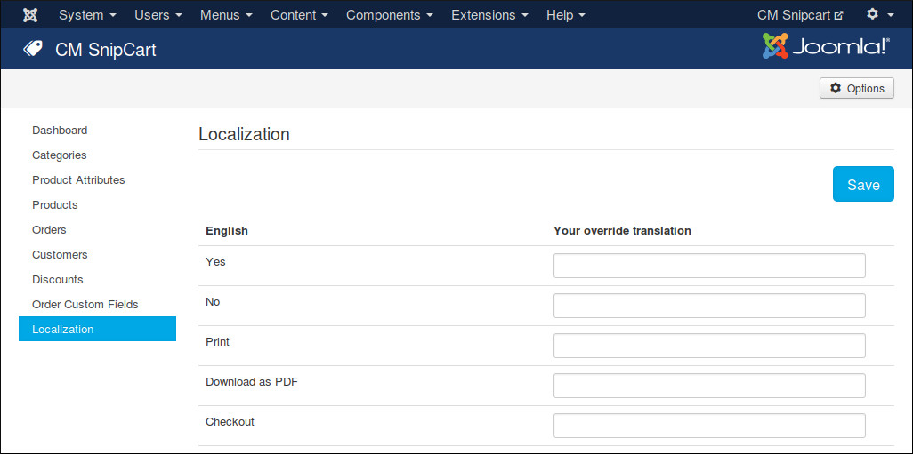

============
Localization
============

Snipcart allows us to override the default texts of Snipcart via JavaScript. You can do this easily in CMSnipcart without touching any JavaScript code.

Click "Localization" menu item on the left menu of CMSnipcart, you can enter your custom text for every Snipcart language text. Only the text which has override version is used, so you can leave the fields of the texts you don't want to override empty.

