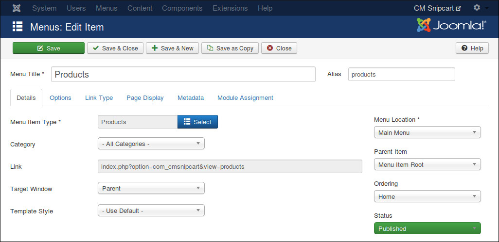
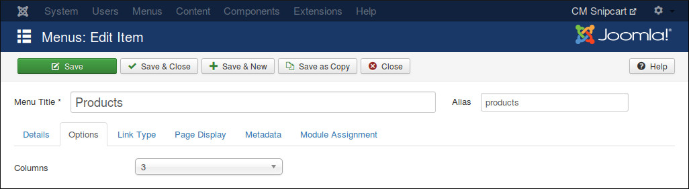
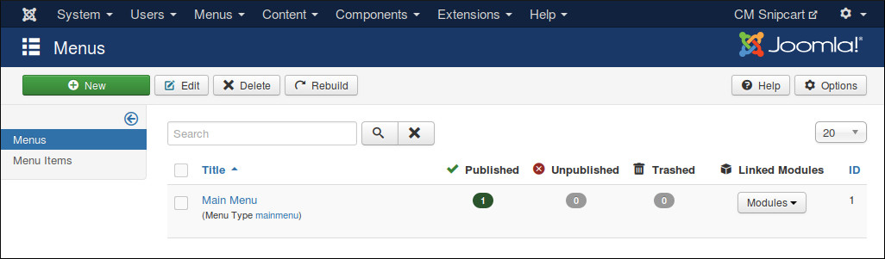
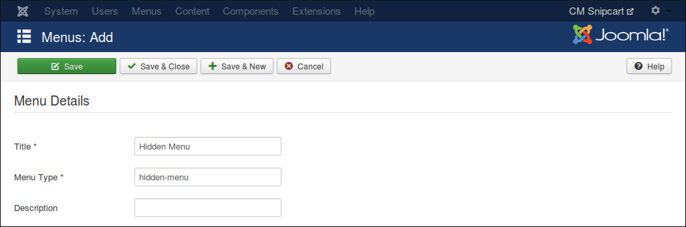
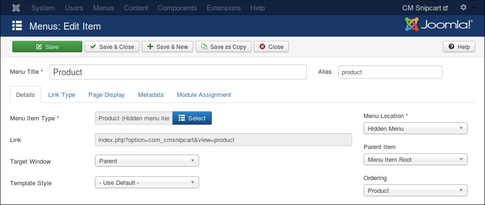
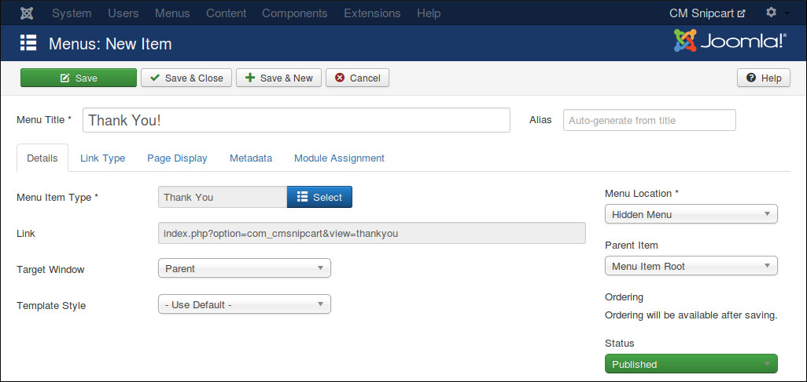

==========
Menu Items
==========

CMSnipcart has 3 menu items which are required to run CMSnipcart properly:

* **Products**: Used to show a list of products. You can show all products or only the products in a specific category.
* **Product**: Used to provide friendly URL for product detail page and help you control the Joomla! module which are displayed in product detail page.
* **Thank You**: After completing an order, customer is taken to this page. This page shows information of completed order.

Products Menu Item
------------------

In your Joomla! back-end, you access the menu where you want to create menu item for product list, click "New" button on the toolbar to create a new menu item.

In "Menu Item Type" option, click "Select" button and select "Products" from CMSnipcart.

If you want to show all products, you select "- All Categories -" in "Category" option, otherwise you select a specific category to show only the products in that category.

Switch to "Options" tab, you can use "Columns" option to configure the column quantity in product list.

Hidden Menu
-----------

Product menu item and Thank You menu item can't be accessed directly. Product menu item needs product information to know what product it needs to show, Thank You menu item only shows information of the latest paid order.

In order to hide Product and Thank You menu item, we need to put these menu items in a menu which is not assigned to any menu module (hidden menu), then the menu and its menu items are not displayed in front-end.

If you don't have any menu like this yet, you can create one by access Menus -> Manage in your back-end's top menu.

Click "New" button on the toolbar to create a new menu. Give your new menu a title and a menu type.

Product Menu Item
-----------------

Create a new menu item for Product, ensure you select your hidden menu in "Menu Location" option.

Thank You Menu Item
-------------------

Similar to Product menu item, you create a new menu item for Thank You, put it in your hidden menu.

