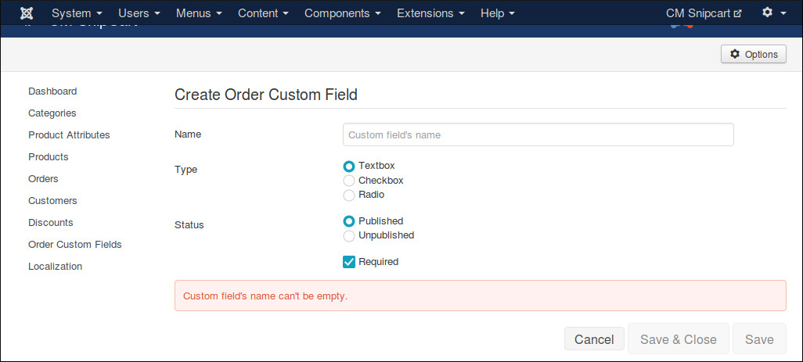

===================
Order Custom Fields
===================

Order custom fields are displayed in "ORDER INFOS" tab which is inserted before "BILLING ADDRESS" tab during the checkout process.

You can use order custom fields to ask customers for various information, for example if they agree with your terms of service, if they need to leave notes for delivery, etc...

In your Joomla! back-end, navigate to Components -> CM Snipcart -> Order Custom Fields.

Click "New" button to create a new custom field.

You can create custom field as a textbox for customers to enter text, as a checkbox for true/false or yes/no question, or radio buttons if you want customers to choose 1 in many options.

When your custom field is radio type, you need to create some options for customers to choose.

To delete options, you click the red X button on the right side of option's name.

If you check "Required" checkbox, customers must enter something (for textbox type), or check the checkbox (for checkbox type), or select an option (for radio type).

In custom field list, you can change the fields's statuses by clicking the icons in "Status" column; you can sort the fields by drag and drop the icons in "Ordering" column; you can select the fields you want to delete and click "Delete" button.

Here is a sample result:

