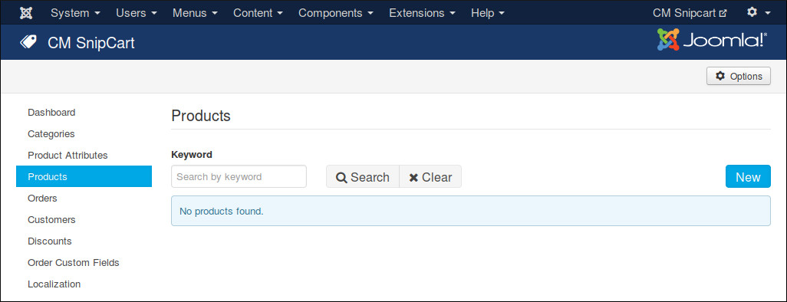
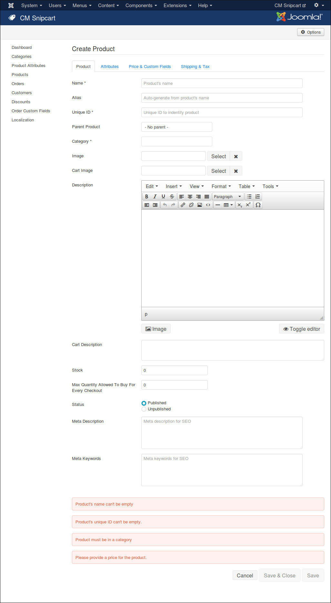
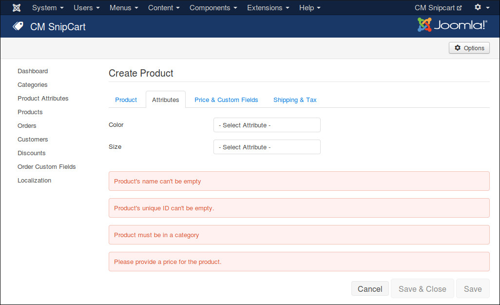
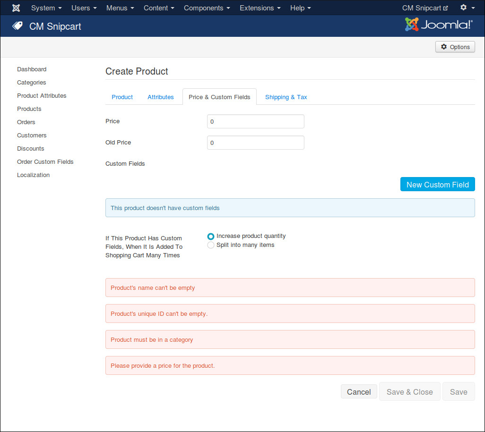
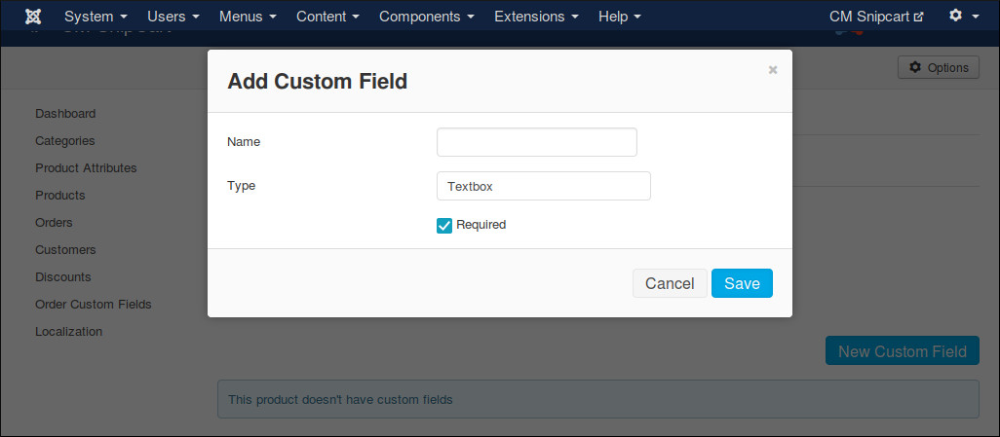
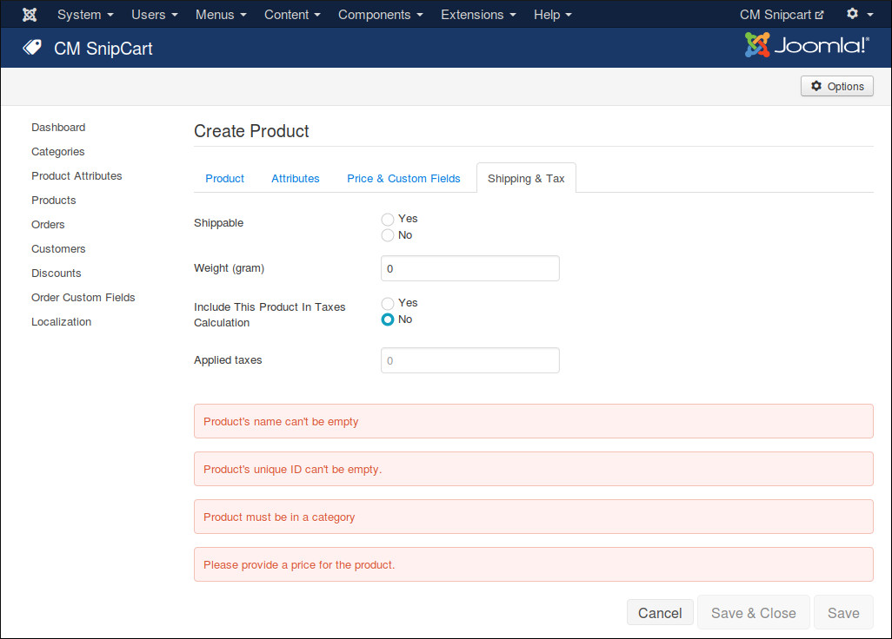
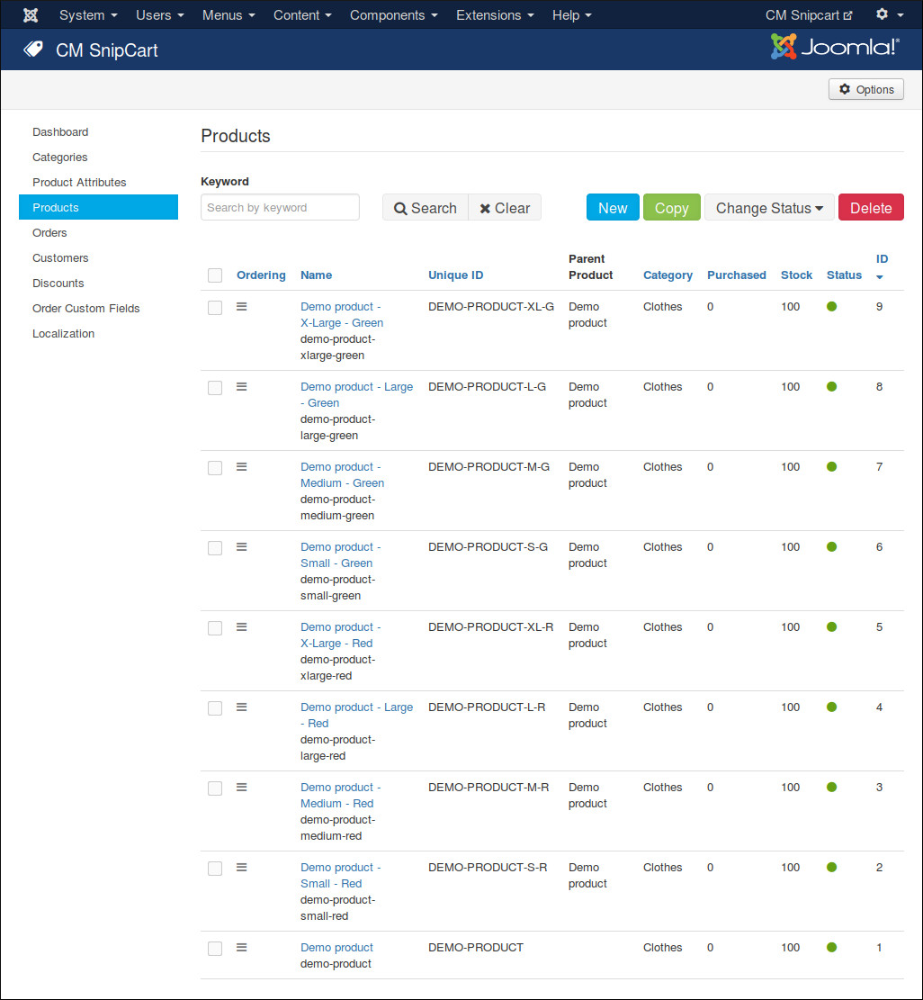

========
Products
========

Create New Product
-------------------

Navigate to Components -> CM Snipcart -> Products in your Joomla! back-end to access product list.

Click "New" button to create a new product.

We have the following fields in "Product" tab:

* **Name**: Product's name.
* **Alias**: Product's alias for friendly URL.
* **Unique ID**: An unique ID to indentify this product (for example SKU). You need to use this unique ID to apply discounts to this product in Snipcart dashboard.
* **Category**: The category which the product is in.
* **Image**: Product's image which is shown in product list and product detail page.
* **Cart Image**: Product's image which is shown in Snipcart's shopping cart popup. If there is no image provided, the main image will be used.
* **Description**: Product's description which is shown in product detail page.
* **Cart Description**: A short description of product, it is shown in Snipcart's shopping cart popup.
* **Stock**: Product's inventory.
* **Max Quantity Allowed To Buy For Every Checkout**: The max quantity customers are allowed to buy for every checkout. This value is used to generate quantity dropdown list (if you show it). If the value is 0, the default value in the component's configuration is used.
* **Status**: This info is currently not used. You can keep the default "Published" value.
* **Meta Description**: Meta description for search engine optimization.
* **Meta Keywords**: Meta keywords for search engine optimization. Keywords are separated by comma.

In "Attributes" tab, you can select the attributes of your product. If there is no attributes needed, you can leave the fields blank.

If product has attributes, you need to create a parent product and some child products which have their own specfic attributes. Please see the next section :ref:`Parent and Child Products <ref-child-products>` for more info.

In "Price & Custom Fields" tab, you can set the sale price or the old price of your product. If your product needs custom fields which cutomers can select at checkout, you click "New Custom Field" button to create new custom field.

You need to give your custom field a name, select its type. There are 4 supported types:

* **Textbox**: Could be used to ask customers to enter short text.
* **Textarea**: Could be used to ask customers to enter long text, like notes.
* **Checkbox**: Could be used for a true-false or yes-no question.
* **Radio**: Could be used to ask customers to select 1 in many options.

If custom field is required (customers must enter something or select an option), you check "Required" checkbox.

If your product has custom fields, it is recommended that you select "Split into many items" for "If This Product Has Custom Fields, When It Is Added To Shopping Cart Many Times", so that customers can select/enter many options fo every item in shopping cart.

If your product is shippable, in "Shipping & Tax" tab you set "Shippable" option to "Yes" and enter your product's weight in "Weight" field (in gram).

To include your product in checkout's tax calculation, you set "Include This Product In Taxes Calculation" to "Yes" and enter the IDs of the taxes you want to apply to this product in "Applied Taxes" field, tax IDs are separated by a comma, for example "TPS,TVQ". The tax ID must be the exact same name that is defined in the dashboard or you can use the unique ID that is generated, you can find this ID in the URL when editing an existing tax. Note that the unique IDs will not be the same in Live and Test modes.

.. _ref-child-products:

Parent and Child Products
-------------------------

If your product has many attributes, you must create a parent product and child products which have specific attributes.

The parent product is shown in product list. When viewing product detail, the attributes of the child products are shown for customers to select. The product which customer add to cart is the child product, not the parent.

**Example**: You sell t-shirt which has many sizes and colors, first you need to create a parent product for this t-shirt, depending on how many variants you have for your t-shirt, you need to create many child products for it. For example if your t-shirt has 2 colors green and blue, every color has 2 sizes small and large, then you need to create the following child products:

* a child product for green t-shirt in small size
* a child product for green t-shirt in large size
* a child product for blue t-shirt in small size
* a child product for blue t-shirt in large size

In this way, every child product has its own image, description, price, stock and unique ID (which can be used as SKU)...

Change Status
-------------

In product list, you can click on the green or red circle in "Status" column to change product status to "Published" or "Unpublished" state. You can do the same to products and order custom fields.

Delete Products
---------------

To delete products, you select them in product list and click "Delete" buton and click "Yes" in confirmation popup.

Sort Products
-------------

To sort products, you click "Ordering" column header in product list, then you click drag and drop the icons in "Ordering" column to sort the products.

Copy Product
------------

If you need to to create many products which have similar info, it is faster if you create 1 product and copy it to many products. You can select a product in product list, click "Copy" button, you are taken to product form which has the info of the selected product filled automatically in the form, now you can just edit what needs to be changed.

This function is helpful when you create child products which are often have the same or similar info with their parent product.