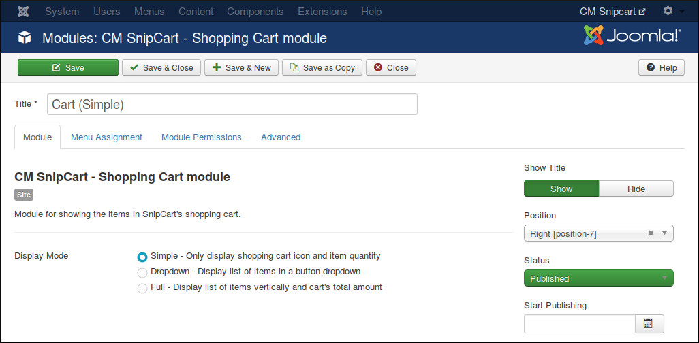
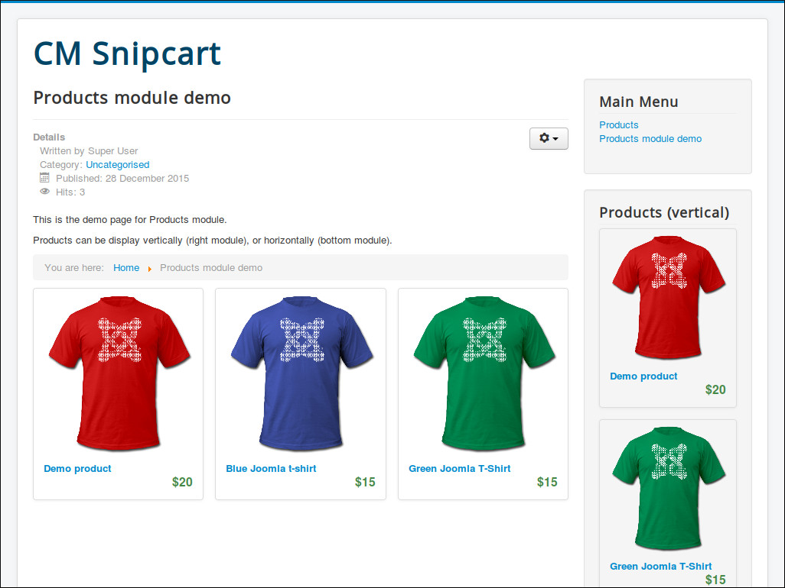

===============
Products Module
===============

Products module show your products, there are many options helping you configure what products to show.

In Modules section in your Joomla! back-end you find the module "CM Snipcart - Products module" or click "New" button on the toolbar to create one.

.. image:: ../images/module_list.jpg

If you select "1" for "Products Per Row" option, your products are shown in 1 column (vertically).

You can limit the quantity of products to show with "Max Products To Show" option.

With "Category" option, you can configure to get products from all categories or only get from the selected category.

In "Select Products" option you can configure to get products randomly, get products by their ordering, or get the products which have less purchases first.

