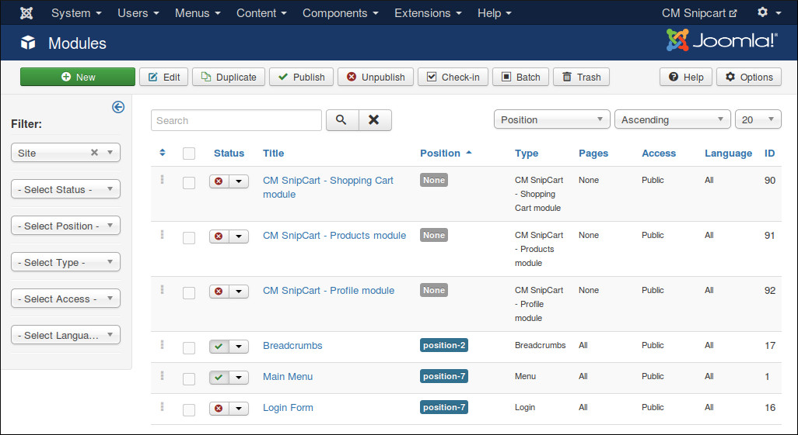
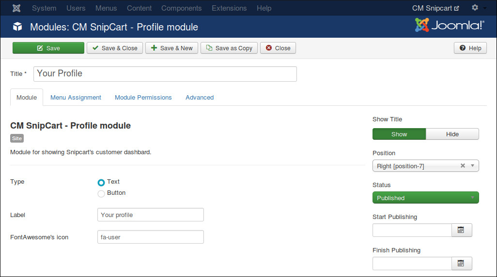
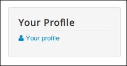
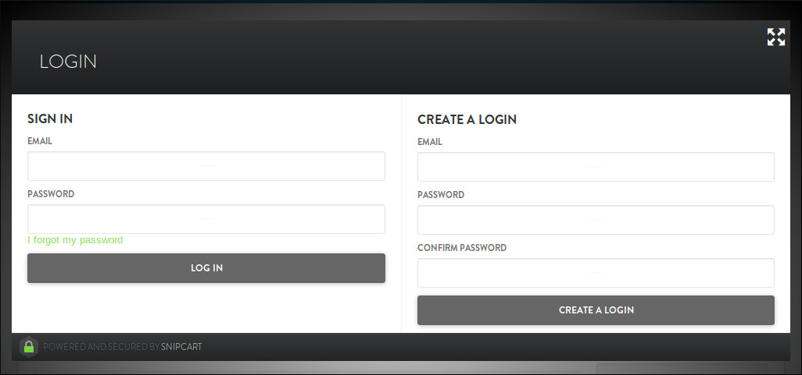
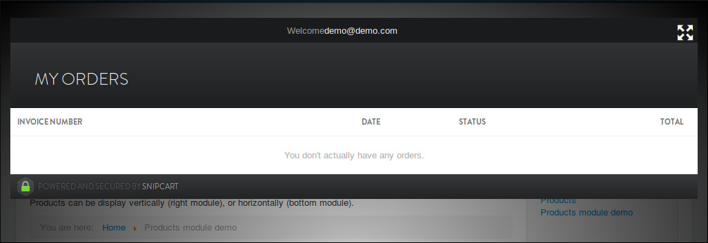
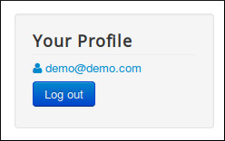

==============
Profile Module
==============

Profile module helps you show a link to open Snipcart's login in order to view order history.

In Modules section in your Joomla! back-end you find the module "CM Snipcart - Profile module" or click "New" button on the toolbar to create one.

There are 3 options for this module:

* **Type**: The link is text or a button.
* **Label**: The label of the link (or the button). For example, "Your profile" or "Login".
* **FontAwesome's icon**: You can show a FontAwesome icon on the left side of the label. For example you can use "fa-user" icon. You can get the icon's class name `here <https://fortawesome.github.io/Font-Awesome/icons/>`_. If you use FontAwesome icon, FontAwesome must be loaded in CMSnipcart component's configuration or loaded by other extensions like plugins or your current template.

When you are not logged-in, the icon and the label are shown as the login link:

When you click on the link, Snipcart's login popup appears, you can login or register a new account:

If you are logged-in, you can see your order history:

If you are logged-in and the Snipcart's popup is closed, you can see your email displayed in the module. Click on the link again to open Snipcart's order history.

