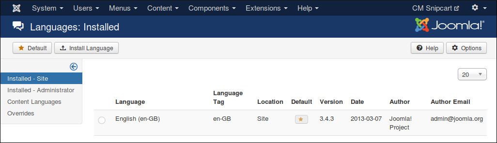
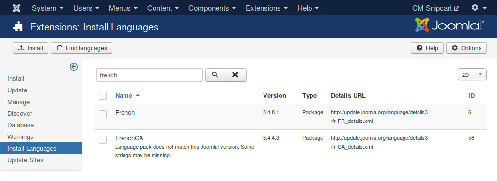
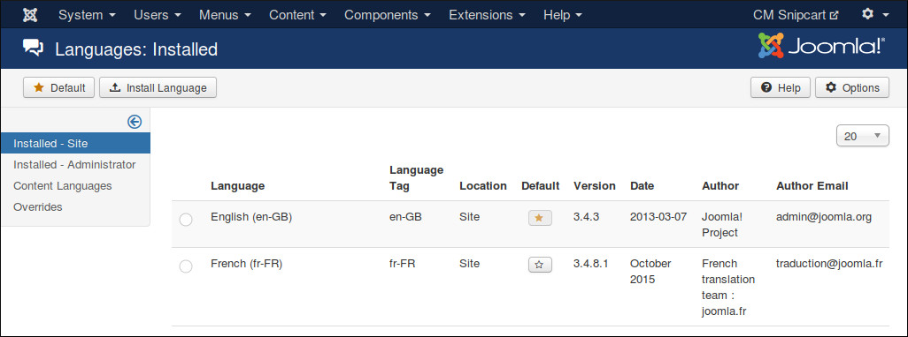

===========
Translation
===========

CMSnipcart only comes with English by default however you can always translate CMSnipcart to other languages.

Installation
^^^^^^^^^^^^

Before translating CMSnipcart to another language, you need to know install that new language.

In your Joomla! back-end, you go to Extensions -> Language(s). You can see the list of installed languages on your site. Click "Install Language" button on the toolbar to install a new language.

Search for the language you want to install, select it in the list and click "Install" button.

After installing new language, go back to the installed language list, you can see your new language in the list.

You need to remember the language tag of your new language. In the above screenshot, French language package is installed, and "fr-FR" is the language tag of French.

Preparation
^^^^^^^^^^^

You can use your favorite FTP software or file managers available in your hosting control panel to navigate to <Joomla! root folder>/components/com_cmsnipcart/language/ folder. In this folder you can see the folder "en-GB", this is where the language files of English are stored.

In this "language" folder, you create a new folder for your new language, the name of the folder is the language tag. Follow the above example, you create a new folder "fr-FR".

Go to "en-GB" folder, copy "en-GB.com_cmsnipcart.ini" file in this folder to the new language folder that you just create ("fr-FR" as in the example).

In the new language folder folder, rename "en-GB.com_cmsnipcart.ini" to "xx-YY.com_cmsnipcart.ini", "xx-YY" is the language tag of your new language, eg "fr-FR".

Translate
^^^^^^^^^

Open "xx-YY.com_cmsnipcart.ini" with a text editor and translate the English strings in this file to your new language.

*Important note*: Joomla! language INI files must be saved as UTF-8 without the Byte Order Mark (BOM). For more information on Byte Order Mark see `http://unicode.org/faq/utf_bom.html#BOM <http://unicode.org/faq/utf_bom.html#BOM>`_

The above instruction is for translating the front-end of CMSnipcart component. To translate the back-end and other extensions, you need to repeat the above steps for the following folders:

* **CMSnipcart component's back-end**: <Joomla! root folder>/administrator/components/com_cmsnipcart/language/
* **CMSnipcart system plugin**: <Joomla! root folder>/plugins/system/cmsnipcart/language/
* **Products module**: <Joomla! root folder>/modules/mod_cmsnipcart_products/language/
* **Profile module**: <Joomla! root folder>/modules/mod_cmsnipcart_profile/language/
* **Shopping cart module**: <Joomla! root folder>/modules/mod_cmsnipcart_cart/language/